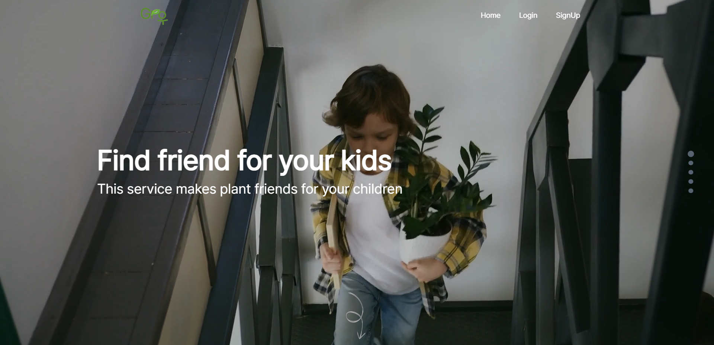
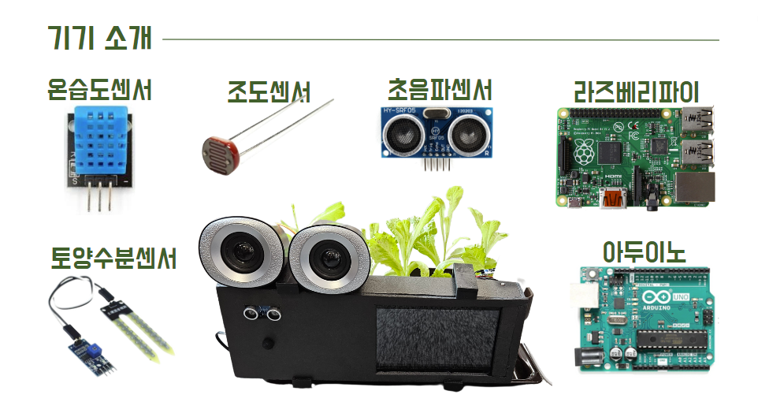
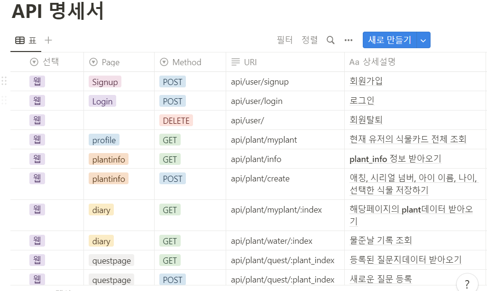
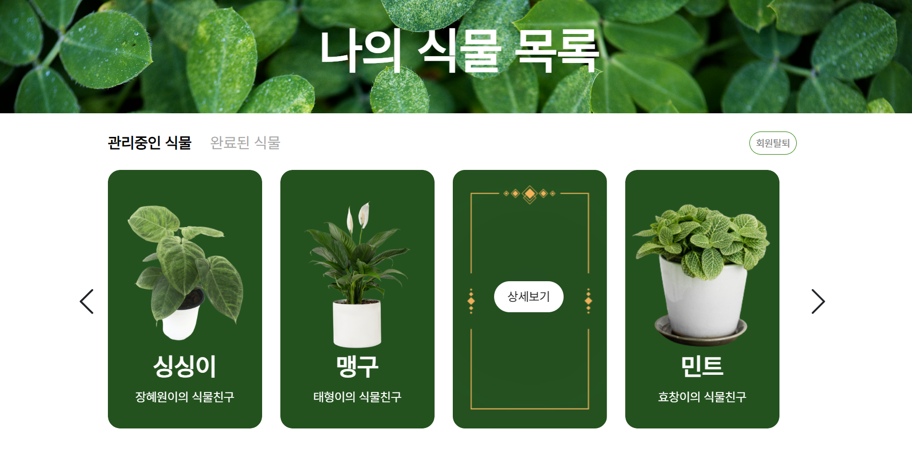
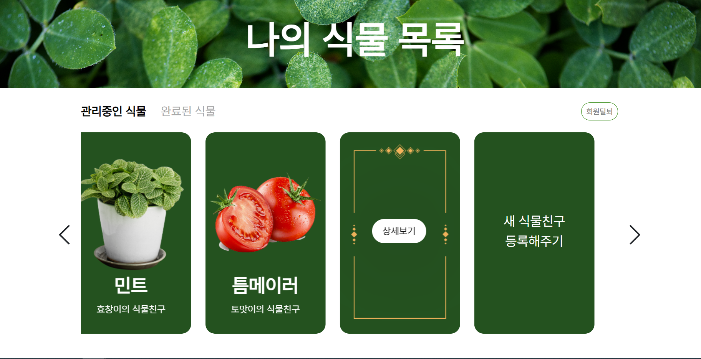
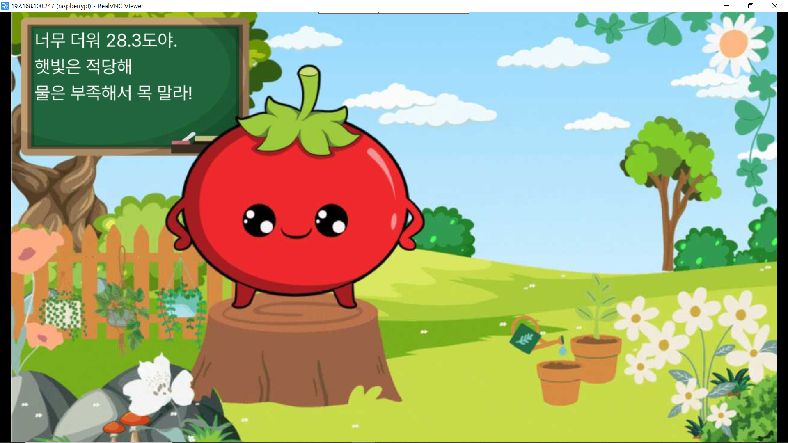
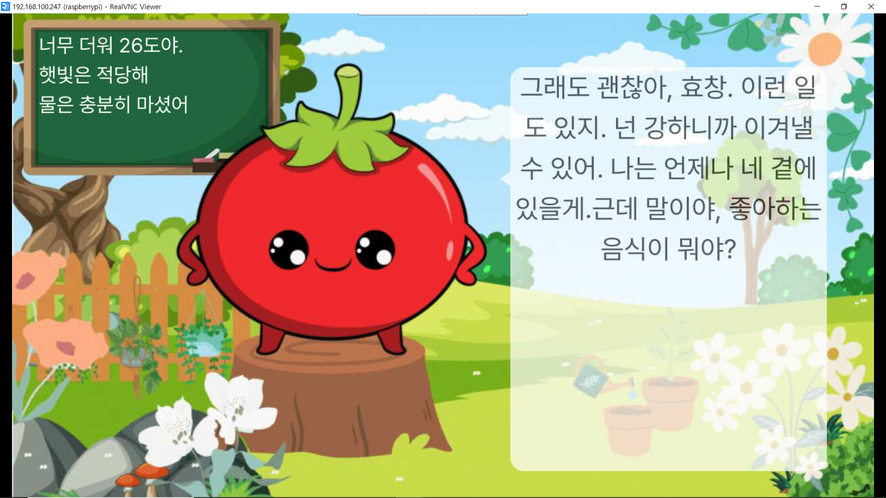

  


# 속닥속닥 식물친구 , Grow 

---

### 1 :four_leaf_clover: 프로젝트 개요

:four_leaf_clover: **개발 기간**

| 개발기간 | 2023.07.10 ~ 2023.08.18 (6주) |
| -------- | ----------------------------- |

:four_leaf_clover: **팀원 소개**

| 팀원   | 역할                  |
| ------ | --------------------- |
| 용효창 | 팀장, IoT , 배포      |
| 강신욱 | BE, DB, websocket, AI |
| 김민국 | display, websocket    |
| 김태형 | FE, 디자인            |
| 박성민 | Iot, TTS              |
| 장혜원 | FE, 디자인            |

:four_leaf_clover: **기획 의도**

| 코로나 이후 국내 홈가드닝 시장의 성장과 2023년 식물재매 시장 5000억원 규모 예상 |
| ------------------------------------------------------------------------------- |
| 전국 지자체에서 반려식물 활성화 사업 진행중                                     |
| 아이의 정서교감 및 안정을 심어주기 위해서                                       |

:four_leaf_clover: **목표**

| Grow 서비스를 통해서 아이의 정서 발달을 도움 |
| 부모가 아이를 더욱 잘 이해할 수 있도록 도움을 주는 소통창구 역할 |
| --- |

---

### 2️ :four_leaf_clover: 서비스 기능 소개

:moyai: **대표기기**


:four_leaf_clover: **대표기능**

- 아이와 식물과의 실시간 대화기능 :speaker:
- 부모의 질문지 등록 :thought_balloon:
- 대화중 질문지에 등록된 질문을 실행 후 대답을 부모가 들을 수 있음 :ear:
- 수분, 조도 센서로 식물 관리
  <br/>

:four_leaf_clover: **메인기술**

## STT

- 아이의 음성을 받아서 음성을 텍스트로 변환
- 클로바 API 선택 : 다양한 어린이 음성을 사용하기 위해서
- 초음파 센서로 거리 감지 후 저장

## TTS

-
-

## GPT

<hr/>

### 3️ :four_leaf_clover: 주요 기술 스택

## 주요 기술

- **_AWS S3_**
  - AWS에서 제공하는 파일 저장과 전송에 특화된 서버
  - 이후 백엔드 서버에서 파일의 이름으로 요청을 보내면 그 파일에 해당하는 URL을 반환하며, 백엔드는 그 URL을 프론트로 전송
- **_OPEN AI Chat API_**
  - OpenAI사에서 제공하는 챗봇 API
  - 아이와의 대화를 구현하기 위해 사용하여 상황에 맞는 말을 생성
  - 센서 데이터를 포함한 데이터를 전송받아 식물의 상황에 맞는 대화가 가능함
- **_web Socket_**
  - 실시간 센서 데이터 iot, 백앤드 전송
  - 실시간 센서테이터 백앤드 , 디스플레이 전송
  - web Socket 두개를 통해서 iot, 백앤드 , 프론트의 유기적인 데이터 전송
- **_React_**
  - 다양한 라이브러리와의 호환성 , 컴포넌트 기반의 가독성 높기 떄문에 선택
  - RESTful, axios를 통한 백엔드와의 데이터 전송방식 선택
  - bootstrap, mui, scss등 다양한 css방식 사용
- **_Redux-toolkit_**
  - 상태를 더욱 쉽게 예측가능하게 하기 위해서 도입
  - Redux-toolkit으로 데이터 store에 저장 후 사용
- **_Node.js_**
  - 백엔드 구축을 위해 사용
  - 웹소켓 백엔드 서버와 REST API 백엔드 서버에 모두 사용
- **_MariaDB_**
  - DB구축을 위해 사용
  - 관계형 데이터베이스로, mysql과 같은 문법을 사용하여 쉽게 사용할 수 있음


### 4️ :four_leaf_clover: 아키텍처

 <br/>

### 5 :four_leaf_clover: API 명세서

 <br/>

---

### 6 :four_leaf_clover: 서비스 화면

:four_leaf_clover: **웹페이지 설명**

- 식물 목록 확인


    1. 키우는 식물 리스트 확인
    2. 완료된 식물 리스트 확인
<br/>

- 식물 등록 1. 새 식물등록하기 버튼으로 식물등록 페이지 이동
  <br/>

- 식물 상세보기
  <br/> 1. 식물의 물 준 데이터 저장 2. 질문지 등록 3. 질문의 답 음성 듣기 4. 식물 완료 처리
  <br/>

---

<hr/>

:four_leaf_clover: **디스플레이 설명**

- 기본 페이지

<br/>

- 식물의 물 부족 표시 페이지

<br/>

- 식물과 아이의 대화

<br/>

---

### 7 :four_leaf_clover: 기대효과

- 식물 키우기를 통한 아이의 정서발당
- 부모가 자녀를 이해하도록 돕는 도구

<br/>
<br/>
# GIT, JIRA Convention

# GIT Branch Convention

---

- Branch 종류
  - main
    - 배포 가능한 상태의 결과물
  - develop
    - 구현한 기능을 병합하기 위한 브랜치
    - 통합 폴더의 기능
  - feature
    - 개별 기능 구현 브랜치
    - 기능 개발 완료 시 삭제
  - 네이밍 규칙
    - 마지막에 본인 이니셜 붙이기
    - feature/기능/이니셜
    - 예) feature/login/HC

# Git Commit Convention

Message

- 개괄
  - 모든 커밋 메시지는 영어와 한글로 작성
- 구조
  - 기본적으로 커밋 메시지는 아래와 같이 제목/본문/꼬리말로 구성

```jsx
type: subject;

body;

footer;
```

- 커밋 타입(Type)
  - new : 새로운 기능 추가
  - mod : 기능 수정
  - error : 버그 수정
  - docs : 문서 내용 변경
  - style : 포맷, 세미클론은 수정 등 코드가 아닌 스타일에 관련된 수정
  - refactor : 리팩토링 코드
  - test : 테스트 코드 추가 및 리팩토링 테스트 등
  - 타입은 소문자로 시작
  - 타입은 항상 대괄호 안에 파트를 입력하여 시작
  - 예시
    - “fix” → “[HW] fix”
- 제목(Subject)

  - 제목은 50자 이내 작성
  - 파일명의 경우에는 파일면 그대로 사용
  - 과거시제를 사용하지 않고 명령어로 작성
  - 예시

    - 본문(Body)
      - 선택사항
      - 부연 설명 필요 시 작성
      - 100자 미만 작성 권장
    - 꼬리말(Footer)
      - 선택사항
      - issue id를 작성할 때 사용
    - 예시

      ```jsx
      [FE] feat : Login DEsign,py

      한글한글한글
      - 영어말고 한글로
      - 선택사항

      Issue id : 486

      ```

# JIRA Convention

- Epic
  - 기능별 대분류 생성
  - 회원관리 / 식물관리 / 디스플레이 화면 구성 / 대화기능 / 음성데이터 처리 / IoT데이터 정리 / 기타 / 프로젝트 설계
- Story
  - 회원에게 제공되는 서비스/기능 목록
  - 네이밍 규칙 - 문장으로 작성
    - 예) 서비스를 이용하고 싶습니다.
  - Story Point 는 0
- Task
  - 해당 스토리에 관련한 상세 구현 사항
  - 네이밍 규칙
    - 파트는 대괄호에 작성
    - 명사로 마무리
    - 예) [BE] 유저 모델 작성
  - Task의 Story point는 4 이하로 작성
  - Sub Task 작성 대신 확인 가능한 Task로 세분화하여 작성

# CODE Convention

- JS

  - Camel Case : 함수는 두 단어 이상
  - 주석은 최대한 자세히
  - tab은 2칸
  - 작성자 기재하기

- Python
  - tab 4칸
  - 한 줄은 최대 79자까지
  - 클래스 명은 카멜케이스(CamelCase)로 작성합니다.
  - 함수명은 소문자로 구성하되 필요하면 밑줄로 나눕니다.

# port

- ChatGPT server : 30002
- backend server : 30001
- DB server : 3306
- display : 3000
- front server : 3001
