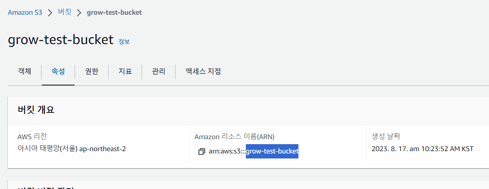

# Porting Guide

## 버전 정리
- node.js: v18.16.1
- MariaDB:  11.0.2-MariaDB-1:11.0.2+maria~ubu2204
- React.js: 18.2.0
- Python: 3.9.2
    ```
    Adafruit-DHT             1.4.0
    aiohttp                  3.8.5
    aiosignal                1.3.1
    appdirs                  1.4.4
    arandr                   0.1.10
    astroid                  2.5.1
    asttokens                2.0.4
    async-timeout            4.0.2
    asyncio                  3.4.3
    attrs                    23.1.0
    automationhat            0.2.0
    backcall                 0.2.0
    beautifulsoup4           4.9.3
    bidict                   0.22.1
    blinker                  1.4
    blinkt                   0.1.2
    buttonshim               0.0.2
    cachetools               5.3.1
    Cap1xxx                  0.1.3
    certifi                  2020.6.20
    cffi                     1.15.1
    chardet                  4.0.0
    charset-normalizer       3.2.0
    ChatGPT-lite             0.0.5
    click                    7.1.2
    colorama                 0.4.4
    colorzero                1.1
    cryptography             3.3.2
    cupshelpers              1.0
    cycler                   0.10.0
    dbus-python              1.2.16
    decorator                4.4.2
    distro                   1.5.0
    docutils                 0.16
    drumhat                  0.1.0
    envirophat               1.0.0
    ExplorerHAT              0.4.2
    Flask                    1.1.2
    fourletterphat           0.1.0
    frozenlist               1.4.0
    gevent                   23.7.0
    google-api-core          2.11.1
    google-auth              2.22.0
    google-cloud-speech      2.21.0
    googleapis-common-protos 1.59.1
    gpio                     1.0.0
    gpiozero                 1.6.2
    greenlet                 2.0.2
    grpcio                   1.56.2
    grpcio-status            1.56.2
    guizero                  1.1.1
    html5lib                 1.1
    idna                     2.10
    ipykernel                5.4.3
    ipython                  7.20.0
    ipython-genutils         0.2.0
    isort                    5.6.4
    itsdangerous             1.1.0
    jedi                     0.18.0
    Jinja2                   2.11.3
    joblib                   1.3.2
    jupyter-client           6.1.11
    jupyter-core             4.7.1
    kiwisolver               1.3.1
    lazy-object-proxy        0.0.0
    LinearRegression         0.0.1
    logilab-common           1.8.1
    lxml                     4.6.3
    MarkupSafe               1.1.1
    matplotlib               3.3.4
    mccabe                   0.6.1
    microdotphat             0.2.1
    mock                     4.0.3
    mote                     0.0.4
    motephat                 0.0.3
    multidict                6.0.4
    mypy                     0.812
    mypy-extensions          0.4.3
    nudatus                  0.0.5
    numpy                    1.24.4
    oauthlib                 3.1.0
    pantilthat               0.0.7
    parso                    0.8.1
    pbr                      5.5.0
    pexpect                  4.8.0
    pgzero                   1.2
    phatbeat                 0.1.1
    pianohat                 0.1.0
    picamera                 1.13
    picamera2                0.3.12
    pickleshare              0.7.5
    pidng                    4.0.9
    piexif                   1.1.3
    piglow                   1.2.5
    pigpio                   1.78
    Pillow                   8.1.2
    pip                      20.3.4
    playsound                1.2.2
    pocketsphinx             5.0.1
    prompt-toolkit           3.0.14
    proto-plus               1.22.3
    protobuf                 4.23.4
    psutil                   5.8.0
    pyasn1                   0.5.0
    pyasn1-modules           0.3.0
    PyAudio                  0.2.13
    pycairo                  1.16.2
    pycodestyle              2.6.0
    pycparser                2.21
    pycups                   2.0.1
    pyflakes                 2.2.0
    pygame                   1.9.6
    Pygments                 2.7.1
    PyGObject                3.38.0
    pyinotify                0.9.6
    PyJWT                    1.7.1
    pylint                   2.7.2
    PyOpenGL                 3.1.5
    pyOpenSSL                20.0.1
    pyparsing                2.4.7
    PyQt5                    5.15.2
    PyQt5-sip                12.8.1
    pyserial                 3.5b0
    pysmbc                   1.0.23
    python-apt               2.2.1
    python-dateutil          2.8.1
    python-engineio          4.5.1
    python-prctl             1.7
    python-socketio          5.8.0
    pyzmq                    20.0.0
    QScintilla               2.11.6
    qtconsole                5.0.2
    QtPy                     1.9.0
    rainbowhat               0.1.0
    reportlab                3.5.59
    requests                 2.31.0
    requests-oauthlib        1.0.0
    responses                0.12.1
    roman                    2.0.0
    RPi.GPIO                 0.7.0
    rsa                      4.9
    RTIMULib                 7.2.1
    scikit-learn             1.3.0
    SciPy                    1.8.1
    scrollphat               0.0.7
    scrollphathd             1.2.1
    semver                   2.10.2
    Send2Trash               1.6.0b1
    sense-emu                1.2
    sense-hat                2.4.0
    setuptools               52.0.0
    simplejpeg               1.6.4
    simplejson               3.17.2
    six                      1.16.0
    skywriter                0.0.7
    sn3218                   1.2.7
    sounddevice              0.4.6
    soundfile                0.12.1
    soupsieve                2.2.1
    SpeechRecognition        3.10.0
    spidev                   3.5
    ssh-import-id            5.10
    statistics               1.0.3.5
    thonny                   4.0.1
    threadpoolctl            3.2.0
    toml                     0.10.1
    tornado                  6.1
    touchphat                0.0.1
    traitlets                5.0.5
    twython                  3.8.2
    typed-ast                1.4.2
    typing-extensions        3.7.4.3
    uflash                   1.2.4
    unicornhathd             0.0.4
    urllib3                  1.26.5
    v4l2-python3             0.3.2
    wavio                    0.0.7
    wcwidth                  0.1.9
    webencodings             0.5.1
    websocket-client         1.6.1
    websockets               11.0.3
    Werkzeug                 1.0.1
    wheel                    0.34.2
    wrapt                    1.12.1
    yarl                     1.9.2
    zope.event               5.0
    zope.interface           6.0
    ```

## DB
- 사용 프로그램: MariaDB
### grow_dump.sql 실행하기
1. mysql WorkBench 홈에서 "MySQL Connections"옆의 + 아이콘을 누른다.
2. 적당한 Connection Name을 지어주고(예: MariaDB), Hostname, Port, Username을 쓴다. 만약 mariadb를 깐 뒤 별도의 처리를 하지 않았다면 기본 값들로 진행해도 좋다.
3. (선택사항) Password의 Store in vault를 눌러 저장해두면, 해당 DB를 사용할때마다 비밀번호를 입력하지 않아도 좋다
4. OK를 눌러 완성하고 나면, 이제 WorkBench에서 SQL 파일을 열어서 전체 실행을 한다.

## 도커
1. 도커 설치(https://wooono.tistory.com/10)
2. git clone https://lab.ssafy.com/s09-webmobile3-sub2/S09P12C103.git

#### ChatGPT_Server
 - 아래의 명령어를 사용하여 도커 이미지 빌드, 실행
 ```
 cd ChatGPT_Server/
docker stop docker-gptserver-demo-container || true
docker rm docker-gptserver-demo-container || true
docker build -t docker-gptserver-demo . 
docker run -p 30002:30002 -d --name docker-gptserver-demo-container \
-e API_KEY={하단의 ChatGPT 참고} \
-e DB_HOST={앞에서 설정한 호스트(예: "localhost", "127.0.0.1")} \
-e DB_USER={앞에서 설정한 유저명(예: "root")} \
-e DB_PASSWORD={mariaDB 설치시에 설정한 해당 유저의 비밀번호} \
-e DB_NAME=grow \
-e DB_PORT={DB가 사용하는 포트. 기본값은 3306} \
-e PORT=30002 \
-e RANDOM_MAX={부모님의 질문이 붙을 대화 수의 최댓값. 숫자를 쓸 것} \
-e RANDOM_MIN={부모님의 질문이 붙을 대화 수의 최솟값. 숫자를 쓸 것} \
-e AWS_REGION={하단의 AWS S3 참고} \
-e AWS_ACCESS_KEY={하단의 AWS S3 참고} \
-e AWS_SECRET_KEY={하단의 AWS S3 참고} \
-e AWS_BUCKET={하단의 AWS S3 참고} \
docker-gptserver-demo
```

#### BackEnd_Server
 - 아래의 명령어를 사용하여 도커 이미지 빌드, 실행
 ```
cd BackEnd_Server/
docker build -t docker-backendserver-demo . 
docker stop docker-backendserver-demo-container || true
docker rm docker-backendserver-demo-container || true
docker run -p 30001:30001 -d --name docker-backendserver-demo-container \
-e API_KEY={하단의 ChatGPT 참고} \
-e DB_HOST={앞에서 설정한 호스트(예: "localhost", "127.0.0.1")} \
-e DB_USER={앞에서 설정한 유저명(예: "root")} \
-e DB_PASSWORD={mariaDB 설치시에 설정한 해당 유저의 비밀번호} \
-e DB_NAME=grow \
-e DB_PORT={DB가 사용하는 포트. 기본값은 3306} \
-e PORT=30001 \
-e JWT_SECRET_KEY={JWT 암호화를 위한 무작위 스트링. (예: sUpErDuPeRmEgAsEcReTkEy)} \
-e RANDOM_MAX={부모님의 질문이 붙을 대화 수의 최댓값. 숫자를 쓸 것} \
-e RANDOM_MIN={부모님의 질문이 붙을 대화 수의 최솟값. 숫자를 쓸 것} \
-e AWS_REGION={하단의 AWS S3 참고} \
-e AWS_ACCESS_KEY={하단의 AWS S3 참고} \
-e AWS_SECRET_KEY={하단의 AWS S3 참고} \
-e AWS_BUCKET={하단의 AWS S3 참고} \
docker-backendserver-demo
```

#### FrontEnd_Server
 - 아래의 명령어를 사용하여 도커 이미지 빌드, 실행
 ```
cd FrontEnd_Server/
docker build -t docker-frontendserver-demo . 
docker stop docker-frontendserver-demo-container || true
docker rm docker-frontendserver-demo-container || true
docker run -p 3001:3001 -d --name docker-frontendserver-demo-container \
-e DB_HOST={앞에서 설정한 호스트(예: "localhost", "127.0.0.1")} \
-e DB_USER={앞에서 설정한 유저명(예: "root")} \
-e DB_PASSWORD={mariaDB 설치시에 설정한 해당 유저의 비밀번호} \
-e DB_NAME=grow \
-e DB_PORT={DB가 사용하는 포트. 기본값은 3306} \
-e PORT=3001 \
docker-frontendserver-demo
```
#### Display_Server
 - 아래의 명령어를 사용하여 도커 이미지 빌드, 실행
 ```
cd display/display/
docker build -t docker-displayserver-demo . 
docker stop docker-displayserver-demo-container || true
docker rm docker-displayserver-demo-container || true
docker run -p 3000:3000 -d --name docker-displayserver-demo-container \
-e DB_HOST={앞에서 설정한 호스트(예: "localhost", "127.0.0.1")} \
-e DB_USER={앞에서 설정한 유저명(예: "root")} \
-e DB_PASSWORD={mariaDB 설치시에 설정한 해당 유저의 비밀번호} \
-e DB_NAME=grow \
-e DB_PORT={DB가 사용하는 포트. 기본값은 3306} \
-e PORT=3000 \
docker-displayserver-demo
```

## ChatGPT_Server
### ChatGPT API 키 받아오기
1. OpenAI에 가입한다.(구글 로그인 같은 외부 아이디 사용도 가능)
2. 링크(https://platform.openai.com/account/billing/payment-methods)로 이동하여 Add Payment Method를 눌러 진행한다. 해외 결제가 가능한 카드가 필요하다.
3. 결제수단 등록이 완료 되었다면, API Keys로 들어간다. (https://platform.openai.com/account/api-keys)
4. Create new secret key를 눌러 새 키를 발급받는다. 생성된 API키는 생성 이후엔 절대 다시 조회할 수 없으니, 키를 잊어버렸다면 기존 키를 삭제하고 새로 발급 받아야 한다.
5. 생성된 API키를 .env 파일에 아래와 같은 형식으로 추가한다.
```
API_KEY = "sk-..."
```

## AWS S3
- 참고링크: https://inpa.tistory.com/entry/AWS-%F0%9F%93%9A-S3-%EB%B2%84%ED%82%B7-%EC%83%9D%EC%84%B1-%EC%82%AC%EC%9A%A9%EB%B2%95-%EC%8B%A4%EC%A0%84-%EA%B5%AC%EC%B6%95
- IAM 참고 링크: https://velog.io/@chrkb1569/AWS-S3-%EC%A0%81%EC%9A%A9%ED%95%98%EA%B8%B0-IAM-%ED%94%84%EB%A1%9C%EC%A0%9D%ED%8A%B8-%EC%84%A4%EC%A0%95
### AWS 회원가입
- 해외 결제가 가능한 카드가 필요하다.
- 과정은 하단의 링크를 참고할 것
    - https://goddaehee.tistory.com/315

### S3 Bucket 만들기
1. https://s3.console.aws.amazon.com/s3/buckets 로 들어간다
2. "버킷 만들기"를 누른다.
3. 버킷 이름을 정해주고, 리전을 "아시아 태평양(서울) ap-northeast-2"를 선택한다. 객체 소유권은 비활성화를 선택한다.

4. "이 버킷의 퍼블릭 엑세스 차단 설정"은 이하와 같이 설정한다. 아래의 "현재 설정으로 인해~~"에도 체크해준다.

5. 나머지 설정은 기본으로 하여 만들기를 하면 끝

### IAM 
- IAM이란 AWS 서버에 엑세스 키로 접근할 수 있는 사용자이다.
- AWS 서버에 직접 접근하는 것은 위험할 수 있으므로, 한정된 권한을 부여한 IAM을 통해 접근하는 것이 권장된다.
- 2개의 IAM을 만들어야 한다. 하나는 백엔드에서 파일을 가져오기 위한 IAM이고, 다른 하나는 웹소켓 서버에서 파일을 업로드 하기 위한 서버이다.
- 따라서 이하의 과정을 사용자 생성과 엑세스 키 생성을 각각 2번씩 반복해야한다.
    - 만약 보안에 크게 신경쓰지 않는다면 하나만 가지고 진행해도 좋다.

#### 사용자 생성
1. https://us-east-1.console.aws.amazon.com/iamv2/home#/home 로 들어간다.
2. 사용자 밑의 숫자를 누른다.

3. "사용자 생성"을 누른다. 
4. 사용자의 이름을 지어주고 다음으로 넘어간다.
5. "직접 정책 연결"을 선택하고, 검색창에 S3를 입력하여 나온 결과를 확인한다. 백엔드 용이라면 "AmazonS3ReadOnlyAccess"를, 웹소켓 용이라면 "AmazonS3FullAccess"를 선택(좌측의 체크박스 선택)한다. 만약 계정 하나만 만들 거라면 웹소켓용 하나만으로 사용해도 좋다.

6. 나머지는 기본으로 하고 생성을 완료 한다.

#### 엑세스 키 생성
1. 앞에서 만든 사용자를 누른다.

2. 보안 자격증명 -> 엑세스 키 만들기를 누른다.

3. 엑세스 키 모법 사례 및 대안에서 사례를 선택한다. AWS 상에 서버를 구축했다면 "AWS 컴퓨팅 서비스에서 실행되는 애플리케이션"을 선택한다.

4. 선택 후 "위의 권장 사항을 이해했으며 엑세스 키 생성을 계속하려고 합니다"에 체크하고 다음을 누른다.

5. 엑세스키의 설명을 지어준 뒤 "엑세스 키 만들기"를 누른다. 한글은 쓸 수 없다.

6. 엑세스 키와 비밀 엑세스 키를 저장해둔다. 엑세스 키는 여기서만 조회가 가능하고, 이후 어떠한 방법으로도 다시 조회할 수 없으므로, 키를 잊어버렸다면 IAM 사용자를 다시 만들어야 하므로 주의.

7. 6에서 얻은 두 엑세스 키를 .env에 넣는다

#### 버킷 정책 만들기
1. http://awspolicygen.s3.amazonaws.com/policygen.html 에 들어간다.
2. 표시된 부분을 입력한다. principal은 "*", Actions는 "GetObject"와 PutObject 두개를 고르고, ARN은 해당 버켓 페이지 -> 속성에서 확인 가능한 값 뒤에 "/\*"를 붙인다. (예: arn:aws:s3:::grow-test-bucket -> arn:aws:s3:::grow-test-bucket/\*)

3. Add Statement를 누른 뒤, 하단의 Generate Policy를 누른다.
4. 새로 뜬 창의 내용을 복사해둔다.
5. 방금 만든 버켓으로 들어가 권한 탭-> 버킷 정책->편집을 누른다.

6. 방금 복사한 내용을 붙여넣기 하고 변경사항 저장을 누른다.
7. 버킷 페이지에서 권한탭->"퍼블릭 엑세스 차단(버킷 설정)"->편집을 누른다.
8. 아래 사진같이 설정하고 변경사항 저장을 한다.


#### 환경 변수
- AWS_REGION = 버킷을 만들때 정한 지역. 메뉴얼대로 했다면 "ap-northeast-2"이다.
- AWS_ACCESS_KEY = 위에서 얻은 두 엑세스 키 중에서 "엑세스 키"의 문자열
- AWS_SECRET_KEY = 위에서 얻은 두 엑세스 키 중에서 "비밀 엑세스 키"의 문자열
- AWS_BUCKET = 버킷을 만들 때 지어준 이름. 버킷에 들어가서 "속성"탭에서도 확인 할 수 있다.
