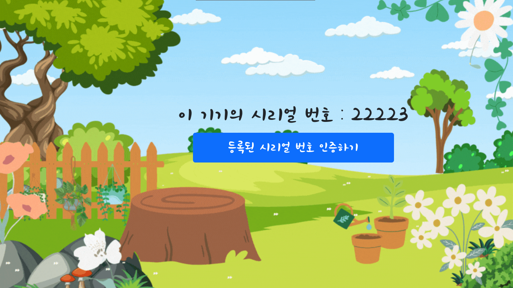
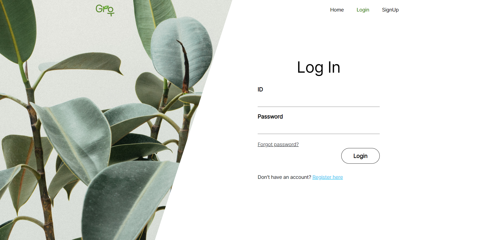
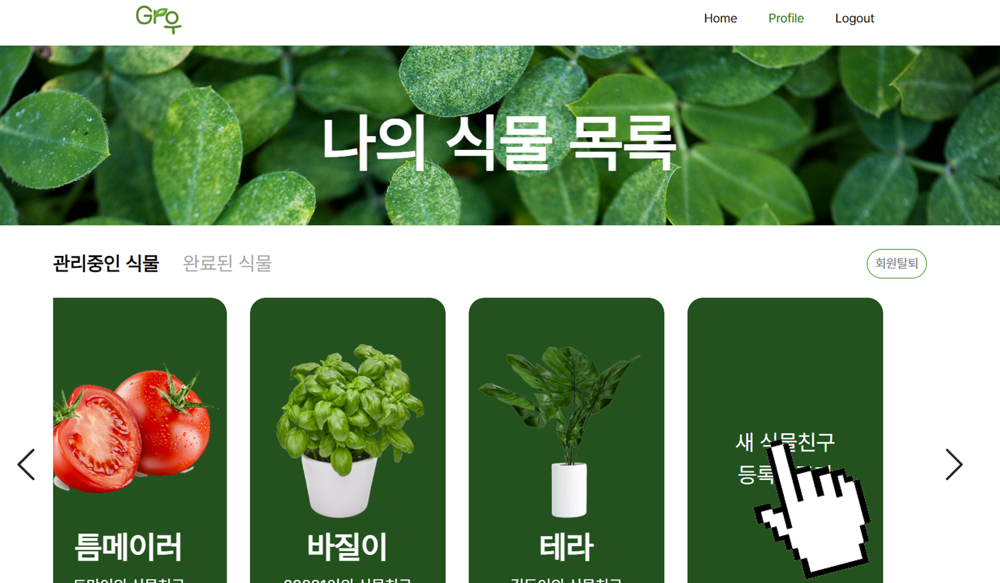
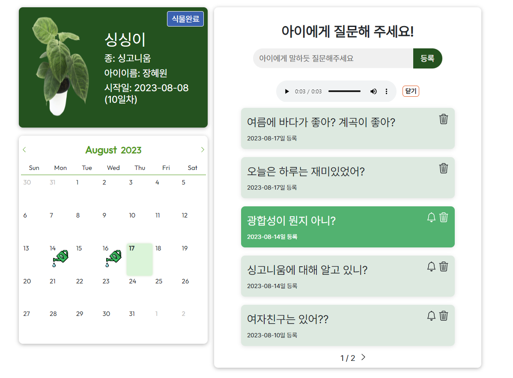
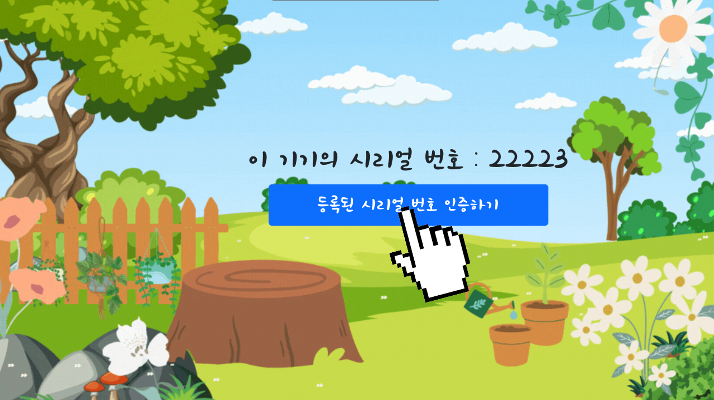
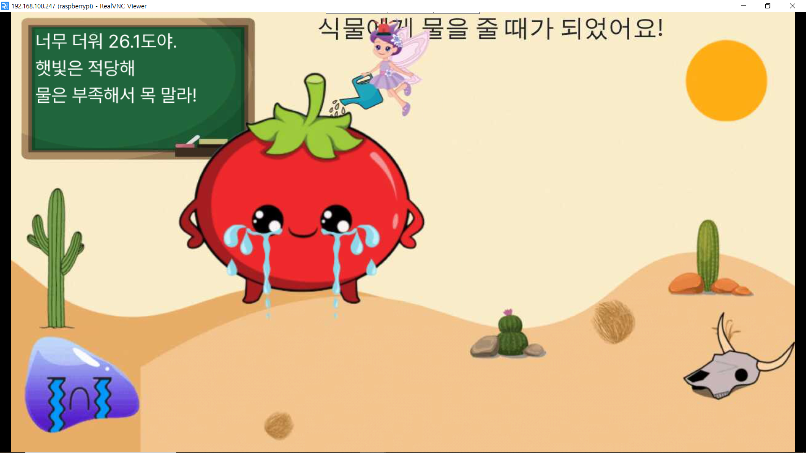
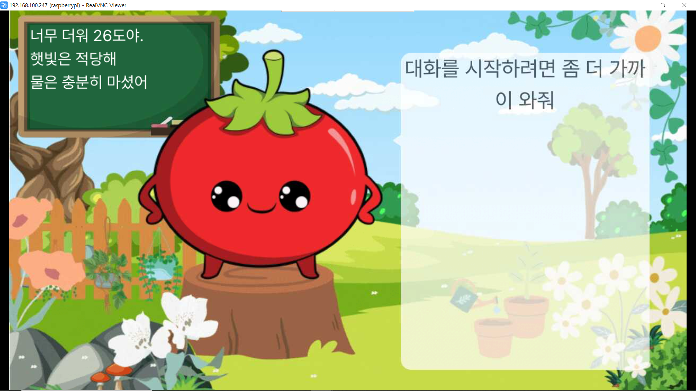
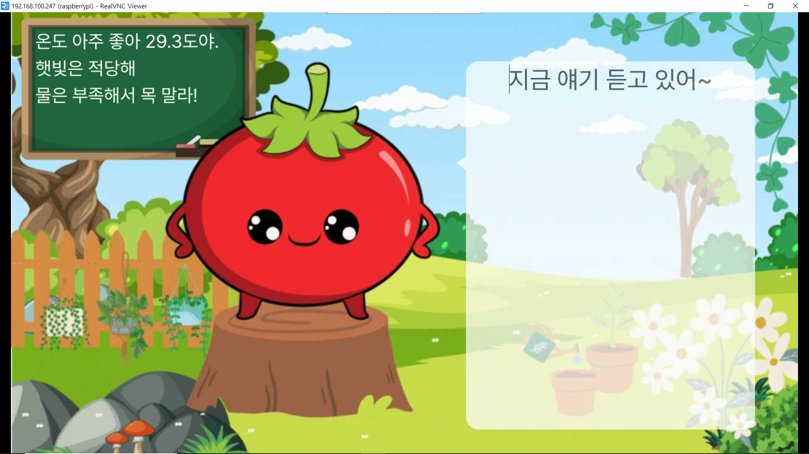
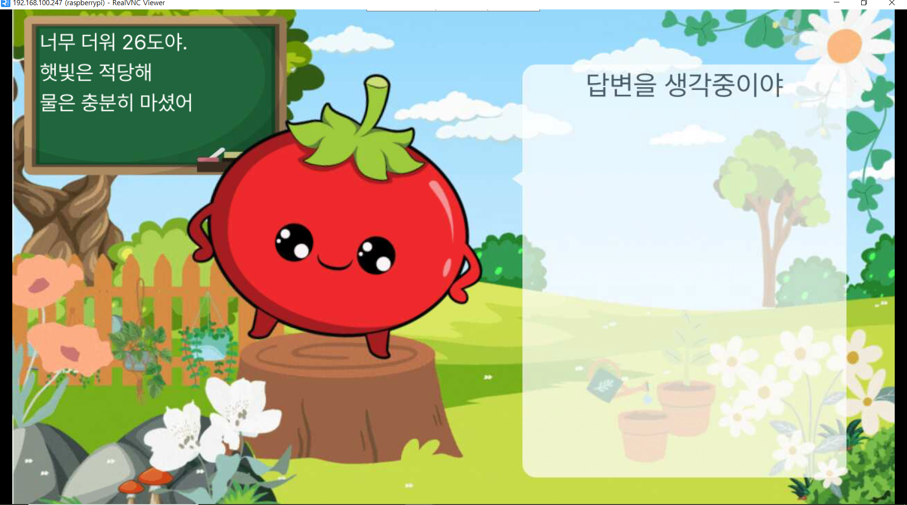
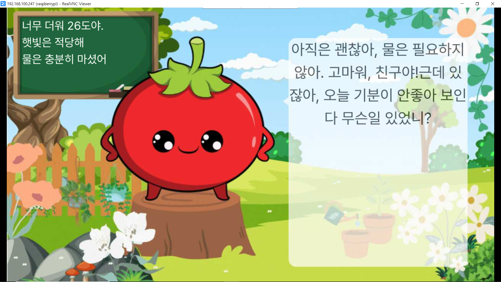

# 시연 시나리오
1. 디스플레이에서 시리얼 번호를 확인한다.

2. 홈페이지 회원가입후 로그인한다

3. 새 식물 등록하기를 클릭한다

4. 각종 정보들을 입력하고 디스플레이에 있는 시리얼 번호를 입력한다.

5. 만들어진 식물의 상세보기를 클릭하면 물준 날짜, 질문 등록, 답변등을 확인할 수 있다.

6. 디스플레이의 시리얼번호를 등록하면  "등록된 시리얼번호 인증하기"버튼을 클릭한다

7. 잠시 기다리면 센서데이터가 화면의 왼쪽위에 아이가 이해하기 쉽게 나타난다.(물이 부족하고, 최근 물준 날짜가 식물마다 정해진 주기를 벗어나면 배경이 사막이 된다)

8. 물을 주면 배경이 변한고 거리센서에 15~30cm사이로 다가가면 "대화를 시작하려면 좀 더 가까이 와줘"라는 말을 한다.

9. 15cm이하로 다가가면 "지금 얘기 듣고 있어~"라고 말한다. 이때 마이크에 대고 하고 싶은 말을 한다.

10. 말을하고 30cm 이상 멀어지면 녹음이 중지되고 stt로 변환후 웹소켓 서버로 전송된다. 디스플레이에든 "답변을 생각중이야"라고 표시된다.

11. 잠시 기다리면 답변이 디스플레이에 표시되고 TTS음성이 스피커를 통해 출력된다.

12. 대화중 식물이 부모가 등록한 질문을 대신 질문한다. 아이가 이에대한 답변을 하면 해당 답변을 녹음한 뒤 서버로 전송한다.

13. 부모는 해당 식물 페이지에서 등록한 질문에 대한 답변을 들을 수 있다.
